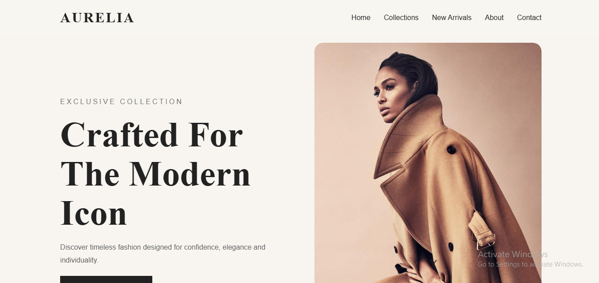

# Aurelia - Website
CorlyRent is a modern, responsive car rental website built to deliver a smooth, stylish, and user-friendly vehicle rental experience. The project focuses on clean UI design, engaging visuals, and intuitive navigation suitable for car rental businesses.

---

## 📌 About Aurelia 

**Aurelia** is a modern luxury fashion house dedicated to elegance, 
Confidence, and inviduality. We design clothing that defines identity, not just style.
---

## Preview Screenshot

## ✨ Features

- ⚡ **Modern, stylish multiple layout** (Home, About, Arrivals, Collections, Contact)
- 📱 **Fully responsive design**  
- 🎨 **Clean UI with smooth animations**  
- 🧭 Animated navigation menu  
- 📨 Contact form design  
---

## 🗂️ Pages Included

| Page | Description |
|------|-------------|
**Home**  | Hero section, intro text ,  featured Collection. |
**About** | Company mission, values, and overview.|
**Collections** | Collection of CLothes. |
**Arrivals** | New arrivals of luxury clothes. |
**Contact** | Clean contact form for user messaging. |

---
## 🛠️ Technologies Used

-**HTML5**
-**CSS3** (responsive layout, advanced styling & animations)  
-**Javascript (E6)** for menu toggle + interactions

---
## Created By Anyikwa Bruno

## 📂 Project Structure